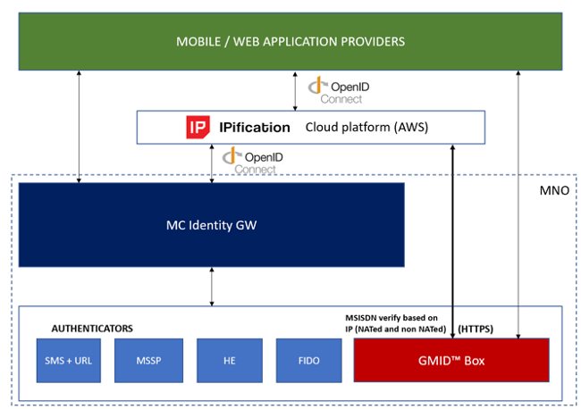
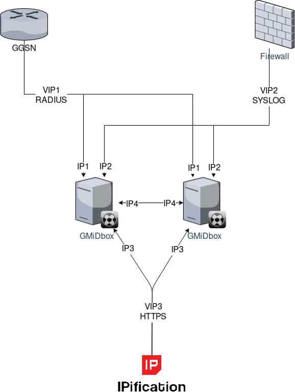
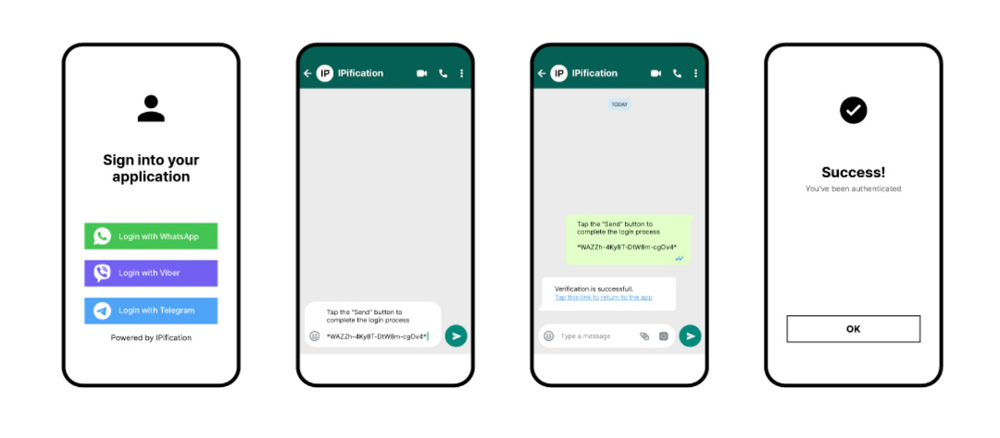
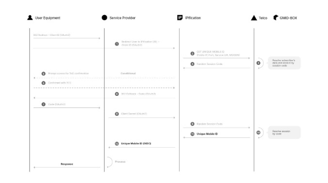
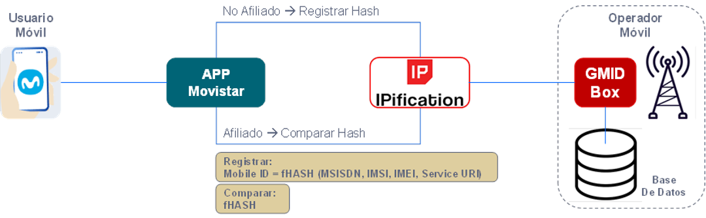
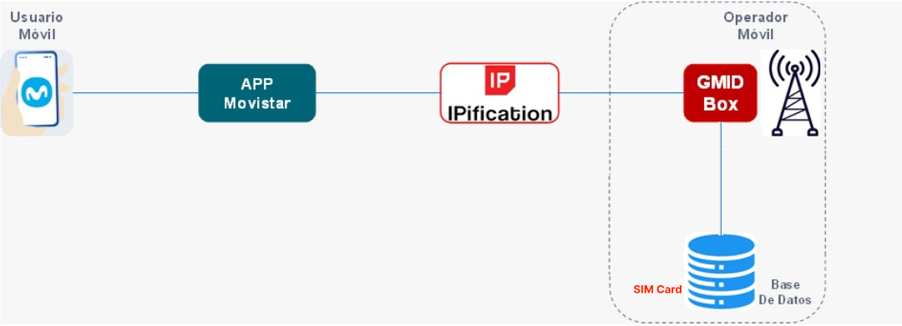
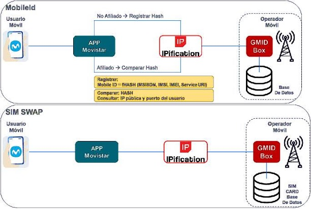
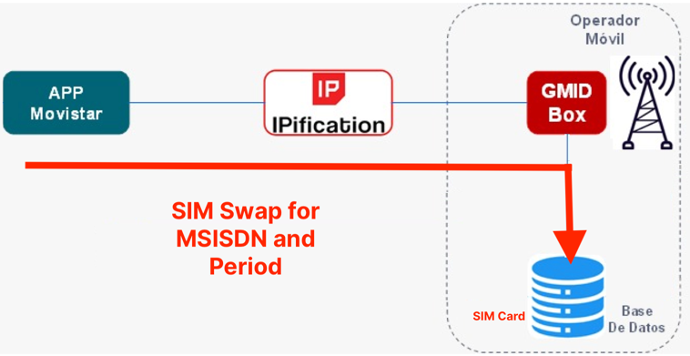
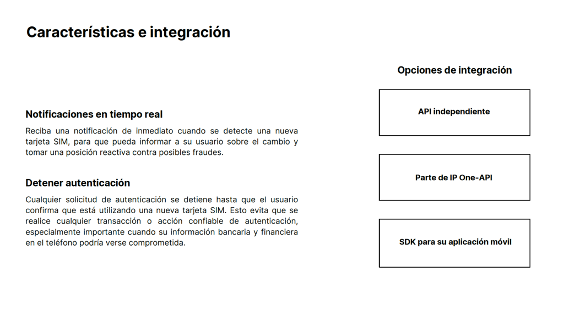

Siga el enlace del video (8:56) presentado por nuestro CEO, Stefan Kostič.
En él se puede tener una visión general sobre la IPification desde el punto de vista de los MNO.
https://drive.google.com/file/d/1TNCPUj9PYrO-7BqbTdPmpjrCvXKYacGU/view?usp=sharing

---

Aquí hay respuestas a sus preguntas.

## 1. En relación a la solución de LATCH, de elevenpaths, en el siguiente link https://latch.elevenpaths.com/ se describe la solución. Consultas:

### 1.1. ¿Existe alguna relación con la solución de autenticación que proponen?

*[Respuesta:]* No existe una relación comercial o privada entre ElevenPaths e IPification. Aún más, no hay similitudes en términos de tecnología / solución. También están en el espacio de autenticación, pero su solución es la solución de autenticación estándar basada en la aplicación con generación de PIN en la aplicación. Su solución no está basada en Telco / Network. Sin duda, la IPification puede ser una buena adición para ellos para actualizar su solución y, desde ese punto de vista, pueden convertirse en un comerciante de IPification que utiliza la red de Telefónica.

### 1.2. ¿IPification tiene o ha tenido relación con elevenpaths?

*[Respuesta:]* No. El año pasado hicimos una presentación comercial de IPification para el Sr. David Pietro Marques del equipo del Sr. Rames Sarwat Shakers. Descubrimos su solución a través del enlace que nos envió y su solución tiene un enfoque totalmente diferente al de la IPification.

## 2. Sobre la figura 1; confirmar que el flujo para la “Solución para Telefónica”, elaborado en base a la “Solución para un proveedor de servicios (SP)”, que es conforme; caso contrario indicar el flujo correcto.

*[Respuesta:]* Para el servicio interno de Telefónica no es necesario integrarse a través de IPification, sino directamente a la API de GMiDbox. IPification como plataforma de identidad centralizada es más para proveedores de servicios de terceros con el fin de facilitar su integración. A través de IPification, solo hay un punto de integración y los SP pueden utilizar la cobertura total que admitimos. Pero para los servicios internos de Telefónica donde los usuarios son solo de Telefónica (no de otras empresas de telecomunicaciones), entonces no tiene sentido integrar a través de IPification, pero la práctica habitual es integrar directamente GMiDbox.

Consultas:
### 2.1. ¿Dónde se encuentra “IP”?
*[Respuesta:]* Como se explicó, IPification IdP no es necesario para los servicios internos de Telefónica. 

### 2.2. ¿GMID estará en el centro de datos de la operadora Telefónica?

*[Respuesta:]* Sí GMiDbox se implementa dentro del centro de datos de Telco (red interna de Telco) para recibir todos los registros necesarios del equipo de red (GGSN / P-GW, CGN-FW).
 
## 3. En relación a la figura 2; confirmar que los flujos de: AUTENTICACIÓN e INFORMACIÓN es conforme, caso contrario indicar los flujos correctos.

*[Respuesta:]* Sí, desde la vista de alto nivel, eso es todo. 

### 3.1. En este servicio, indicar donde se encuentra IP y GMID.
*[Respuesta:]* GMiDbox siempre está en el lado de Telco, y la IPification es entre proveedores de servicios y Telcos (GMiDbox).

## 4. ¿La herramienta que proponen cuenta con los componentes de:

### 4.1. afiliación (Onboarding) para las empresas a las que se proveerá el servicio, así como para sus usuarios a autenticar;
*[Respuesta:]* Claro que sí. Hay funciones de incorporación en GMiDbox a través de la consola GMiDbox. Y, por supuesto, IPification IdP tiene una herramienta de incorporación por separado, pero no está dentro del campo de aplicación de Telcos.

### 4.2. facturación (billing) para facturar por el servicio a final de un periodo?

*[Respuesta:]* Absolutamente La Consola GMiDbox tiene todas las características de Estadísticas / Informes para realizar la conciliación y la facturación.

##
En relación al documento “MNO_Jan-2021.pdf” tenemos las siguientes consultas:

### 1. Página 4; ¿Que implica “Apple will require HTTPS for all iOS Apps? Para la implementación de la plataforma GMID?

Puedes leer sobre esto en muchos artículos en Internet, pero este quizás sea el bueno porque está en español:
https://www.cnet.com/es/noticias/los-apps-de-ios-requeriran-seguridad-https-en-sus-conexiones-para-2017 / Esto no está relacionado con la plataforma GMiDbox. Esta es la decisión de cualquier empresa (plataforma) seria de prohibir el tráfico HTTP simple porque es inseguro. Y teniendo en cuenta que el enriquecimiento de encabezados funciona en HTTP, dejará de funcionar. Y GMiDbox funciona sobre HTTPS y desde ese punto de vista es una solución para el futuro, mientras que HE va al pasado.

### 2. Página 8; ¿Cómo se verifica el cambio de SIM?
Hay una explicación de esto en la página 15. El secreto está en MobileID.

MobileID es un valor especial creado a partir de un triplete de red que incluye MSISDN, IMSI e IMEI. Entonces, cuando se cambia la tarjeta SIM, significa que IMSI es diferente y MobileID será diferente.

### 3. Página 8; describir el acceso instantáneo sin contraseña.
Este caso es en realidad Acceso anónimo. Utiliza solo MobileID, que siempre es el mismo para el mismo usuario. También nos gusta llamarlas cookies del lado del servidor. Este enfoque está interesado en servicios que prefieren posponer el registro de usuarios como comercio electrónico, juegos ...

### 4. Página 11; ¿Cómo se verifica el cambio de terminal?
Hay una explicación de esto en la página 15. El secreto está en MobileID.

MobileID es un valor especial creado a partir de un triplete de red que incluye MSISDN, IMSI e IMEI. Entonces, cuando se cambia la tarjeta SIM, significa que IMEI es diferente y MobileID será diferente.

### 5. Página 12 describe el acceso para dispositivos no móviles (laptop).
Usar el teléfono móvil para acceder a los servicios en la computadora portátil. Creo que la mejor explicación para todos nuestros casos será probar nuestro Portal de prueba en test.ipification.com y / o seguir la presentación del archivo adjunto.
`<<IPification TEST PORTAL.pptx>>`

### 6. Página 13 compartir un caso de uso de Paypal y/o Square.
Siempre la mejor explicación para los servicios de pago es Demo Bank: https://demo-bank.ipification.com.

También tenemos casos (videos) para pagos móviles: https://www.ipification.com/media/centili.mp4

### 7. Página 16 explicar brevemente en que consiste “One OIDC Client for SP.
Lo que queremos decir aquí es que hay integración Única / Una, API única / misma para todos los MNO. Y la API se basa en OIDC - protocolo OpenID Connect.

Significa muy simple y rápido para la integración.

### 8. Página 17 ¿cómo participa Mobile Connect?.
IPification es compatible con Mobile Connect y es un socio listado de Mobile Connect. GMiDbox se puede utilizar como autenticador de backend para plataformas Mobile Connect. Eche un vistazo al diagrama adjunto.
`<<IP-MC-GMID.png>>`

## 
En relación al esquema de la solución, según gráfico al final del presente:

### 1. ¿Qué requiere el “Service Provider” para integrarse al servicio de IPification?
Solo para integrar a IPification OIDC API. Muy simple. La mayoría de los SP ya están familiarizados con OIDC debido al inicio de sesión de Google, inicio de sesión de Facebook ... Todos los inicios de sesión sociales utilizan el mismo protocolo OIDC.

### 2. ¿Cuáles son los requerimientos de infraestructura para el GMID para asegurar una disponibilidad de 99.99%?
Infraestructura de producción estándar de 2 GMiDbox-es en el clúster. Consulte el diagrama de la infraestructura de producción.

`<<HLD_Network.png>>`

### 3. ¿Con qué componente de la operadora se integra el GMID?
También se muestra en el diagrama HLD. GGSN / P-GW y CGN-FW. Consulte el documento de propuesta de implementación de GMiDbox.

Muestra todos los detalles técnicos para la integración de GMiDbox. `<<GMiDbox_Implementation_Proposal.pdf>>`
 

Ejemplo de flujo de usuario con fallback usando IM-Auth .

### 4. Service Mobile Attribution_b_ES_Telefonica-HispAm_Mar-09-22.pdf
### 5. Telco Mobile Attribution_b_ES_Telefonica-HispAm_Mar-2-22.pdf

Entiendo que los documento 4 y 5 son para autenticar al usuario para la descarga de algún servicio en la web. ¿Ello es así?

*[Respuesta:]*  Si. Con las nuevas implementaciones, principalmente de Google y Apple, el uso de cookies se verá perjudicado, haciéndo la vida cada vez más difícil a las grandes empresas de marketing digital.

Con la tecnología de IPification, Telefónica HispAm podrá ofrecer el servicio de Atribución Móvil, que brinda información para que las empresas puedan dirigir usuarios específicos a las atribuciones adecuadas (productos específicos para clientes específicos).

## 
En cuanto al caso de negocio:

### 1. Conforme con el número de abonados y abonados que tienen datos móviles, según lo que conozco.
*[Respuesta:]*  Si. Según las cifras de ingresos financieros y los volúmenes de datos de los últimos años y el A2P total, estimamos que el 25% está relacionado con la autenticación que el servicio de autenticación de IPification cubrirá y ampliará.

### 2. Entiendo, para efectos prácticos, se estima 150 sesiones por abonado en el mes.
*[Respuesta:]*  Exactamente.

### 3. ¿Qué significa el porcentaje total de sesiones cubierto por IPIFICATION en fase III por mes? ¿en qué consiste las fases: I, II Y III?

*[Respuesta:]*  Es decir, del total A2P, aproximadamente el 25% son autenticaciones que serán cubiertas por la tecnología de autenticación IPification.

Cada fase corresponde a un período de 8 meses (3 fases = 8x3 = 24 meses) ya una proyección de crecimiento en el volumen del servicio y, en consecuencia, en los ingresos.

### 4. ¿Por qué el precio varía por cada país?

*[Respuesta:]*  Los precios siguen la realidad de precios de SMS de cada país. Y varían según la variación de SMS de cada país/región.

##

De mi reunión con el líder de Marketing de THISPAM, proponemos el siguiente modelo de negocio: IPIFICATION es el FRONT del servicio, es decir factura al cliente final y luego le paga a Telefónica por la consulta de la data.

### ¿Es factible el modelo propuesto?

*[Respuesta]* Sí, es factible el modelo de negocio propuesto, para implementación inmediata.

De hecho, este es nuestro modelo de negocio. Facturamos al cliente final y pagamos a MNO localmente.

### 1. Respuesta sobre el gráfico

MobileID no se almacena ni se verifica en el lado de GMiDbox

Se almacena y verifica en el lado del servicio (en este caso, Movistar App)

GMiDbox solo genera MobileID y lo devuelve al servicio. 

Este es el gráfico correcto:

 
### 2. Respuesta sobre el SIM Swap (Intercambio de SIM)

En el ejemplo sugerido, el MobileID será diferente.

Entonces, el servicio tendrá un NUEVO MobileID para el mismo número de teléfono (MSISDN).

Porque el Servicio mantiene estos 2 valores de su lado MSISDN : MobileID

Si el usuario real cambia de SIM, deberá demostrar que es el usuario real.

Y luego el Servicio le pide al usuario que verifique por correo electrónico o algún otro método de seguridad (contraseña, código de acceso, pregunta de seguridad...)

### 3. Respuesta sobre la cobertura de la tecnología y la necesidad de contratar el servicio IPification IM Auth para que funcione donde no hay cobertura o el servicio, por alguna razón, deja de estar disponible.

Cuando una región/operador móvil no tiene la solución de IPification instalada y habilitada (casilla GMID), la alternativa será la autenticación de IPification IM.

Los desarrolladores de aplicaciones deben tener contratado el servicio para que funcione.

A continuación se incluye información técnica para desarrolladores de aplicaciones sobre cómo conectarse a IPification IM Auth. Es simple y rápido.

https://developer.ipification.com/#/auth/latest/?id=im-auth

##

### 1. MobileId es un proceso en línea.
Este gráfico es correcto para la verificación de números de teléfono y autenticación IPification:

### 2. SIM Swap es un poco diferente.

 Puede ser manejado por MobileID, pero generalmente tenemos un enfoque diferente para el intercambio de SIM.
SIM Swap es un proceso fuera de línea.
IPIfication flujo de Detección pura de intercambio de SIM:

### 3. ¿Cómo se demuestra que el usuario realmente es quien dice ser?

Después del cambio o primera vez.

Primera vez que hacemos autenticación.

En base a la IP, identificamos el MSISDN. Y podemos comparar el valor real de la sesión con el ingresado por el usuario.

## 1. E 2.

### A. ¿El Gráfico 1 corresponde al servicio MobileId y el Gráfico 2 corresponde al SIM SWAP? 

*[Respuesta:]* Sí exactamente.

### B. ¿MobileId es diferente a SIM SWAP?

*[Respuesta:]* Mobile ID é um valor de hash único consiste no número de telefone (MSISDN), SIM (IMSI) e dispositivo (IMEI) transmitidos por meio do endereço IP público e da porta do usuário.

El hash de MobileID puede reflejar cambios en la tarjeta SIM y el dispositivo. SIM Swap es el intercambio no autorizado de la tarjeta SIM.

### C. Agradeceremos proporcionarnos el flujo completo del servicio SIM SWAP: i) flujo de afiliación al servicio, ii) flujo de validación.
*[Respuesta:]* Por eso escribí en el gráfico número 2, puro flujo de SIM Swap. El flujo completo de SIM Swap sería la fusión de los Gráficos 1 y 2.

###  D. ¿Qué significa “SIM SWAP es un proceso fuera de línea”? ¿la validación si el SIM fue cambiado no es en línea?
*[Respuesta:]* Creo que el significado se perdió en la traducción.
IPification utiliza un enfoque complejo para la detección de intercambio de SIM que es manejado por MobileID (online) y intercambio de SIM puro (offline). Ambos brindan la seguridad y confiabilidad para proteger contra el intercambio no autorizado de SIM (SIM Swap).

### E. ¿Para acceder a los datos del usuario se utiliza únicamente la IP del equipo de móvil? 
*[Respuesta]* Se utiliza la dirección IP pública y el puerto del usuario (User public IP and Port)). 

Período SIM Swap API, en detalles para el equipo técnico.
https://developer.ipification.com/#/simswap/latest/?id=period-sim-swap-api

IPification SIM Swap - Características e integración:

##
Información detallada sobre la tecnología de detección IPification SIM Swap. 

Fuera de línea (Offline) significa que el usuario no está presente en el proceso.

Entonces, por ejemplo, un banco (servidor) puede consultar la base de datos de Telefónica para encontrar la información.

Y el proceso en línea (Online) requiere que el usuario esté presente.

Por lo tanto, es una API de servidor a servidor, fuera de línea, sin interacción del usuario.
##

Aclarado que los servicios MobileId y SIM SWAP son diferentes y por lo tanto tienen diferente alcance. 

*[Respuesta:]* Si.

Seguidamente las siguientes consultas:

#### Sobre MobileId:

Requiere el servicio de afiliación (onboarding) y este se realiza a través de IPIFICATION.

*[Respuesta:]* Si el usuario aún no es cliente de tu aplicación (Movistar App), deberá incorporarse a tu aplicación.

Confirmar que el acceso a la BD para obtener el HASH registrado al momento de afiliar al servicio son la IP Pública y Puerto del Usuario; donde la IP identifica al dispositivo, y el puerto identifica a la aplicación que se ejecuta en el dispositivo.

*[Respuesta:]* El Hash es creado por GMiD box.

El GMiD box utiliza los siguientes parámetros para crear el Hash (MobileID):

IP:PORT --> MSISDN+IMSI+IMEI

MobileID = fHash (MSISDN+IMSI+IMEI+URI (identifica la aplicación))

Así que este es el punto

IP:PORT son para resolución

Todos somos IP:PORT

Cada usuario en Internet es solo IP:PORT

Esa es la raíz de la solución IPification

Y el punto es encontrar quién es ese

Con Telco Network es fácil y GMiD box brinda esa capacidad.

IP y PORT son identificadores de sesión de datos, detrás de los cuales hay algún usuario (MSISDN, IMSI, IMEI).

Usamos IP:PORT para encontrar quién está detrás de esa sesión de datos específica (solicitud de Internet).

#### Sobre SIM SWAP:

Confirmar que la afiliación al servicio lo realiza la empresa (Movistar). La empresa obtiene el consentimiento del usuario para utilizar su dato MSISDN.

*[Respuesta:]* SIM Swap es un servicio fuera de línea (Offline - ya hablamos de esto en el correo electrónico de ayer). Por lo tanto, el usuario no necesita estar presente en el momento de la verificación.

Así, se puede recabar el consentimiento por adelantado (durante el tiempo de registro) en caso de ser necesario para dichos datos. 

Por lo general, no es necesario porque los datos solo son Verdadero/Falso.

Desde la perspectiva de GDPR, este tipo de servicio es Protección y seguridad del usuario (Prevención de fraude) y se trata como Intereses legítimos.

Confirmar que la empresa (Movistar) consulta a la BD para verificar si hubo cambio de SIM con el número MSISDN.
*[Respuesta:]* Sí, con MSISDN y Date From.

Por ejemplo: ¿El número de teléfono XYZ cambió la SIM del 2022-06-01? Y la respuesta es Sí/No (Verdadero/Falso)

### Si hoy me afilio al servicio de SIM SWAP, ¿Cómo se sabe si hay cambio de SIM? 

*[Respuesta:]* En el lado de Telco, GMiD box recopila (Collects) los cambios de SIM. Hay SIM Change DB en el lado de GMiD box que se recopila todo el tiempo.

Para este servicio, ¿cuál es el proceso para registrar los datos en el GMID Box?

*[Respuesta:]* La recopilación de datos (Data collection) ocurre cuando el usuario ingresa a la red (y datos móviles).
Según el mensaje RADIUS y los atributos (MSISDN, IMSI, IMEI), GMiDbox almacena los pares MSISDN - IMSI junto con la FECHA (DATE) de cambio de IMSI.

###  ¿Qué datos se registra en el GMID Box?

*[Respuesta:]* Imagina que compraste una nueva tarjeta SIM el 1 de febrero de 2022, con MSISDN: XYZ y el IMSI es: 123.
Cuando se una a la red (encienda su teléfono), GMiDbox registrará: XYZ - 123 - 2022/02/01.

Y el 1 de junio de 2022 decidió cambiar su SIM de 4g a 5g, y esa nueva SIM tiene IMSI 456 pero el mismo MSISDN XYZ.

Cuando se una a la red con una nueva SIM (encienda su teléfono), GMiDbox registrará: XYZ - 456 - 2022/06/01.

Entonces, si el cliente nos pregunta: "¿MSISDN = XYZ cambió la SIM después del 23 de mayo de 2022?", Encontraremos que el último cambio de SIM para XYZ fue el 2022/06/01, que es posterior al 2022/05/23 y le responderemos : "Sí".

##

Una aclaración adicional, para el caso del servicio de MobileId:
### o Para obtener el Mobile ID de la BD; en un documento se indica que se obtiene con los datos (Public IP, Port, URL) y en otro documento se indica que se obtiene con los datos (Public IP:Port, Client ID, Service URI) ¿cuál es el correcto?
*[Respuesta:]* Para obtener datos de la base de datos, solo se utilizan IP y PORT, ya que representan la sesión. 

ServiceURI (URL corto) se utiliza para generar MobileID.

ServiceID para detalles de estadísticas.

Entonces ambos son correctos

Y ninguno está completo. En una presentación solo ponemos los parámetros necesarios. 

Para conocer las especificaciones completas de la API, consulte el documento adjunto. `<<GMiDbox_API_Auth_Telefonica-HisAm_Jun-2022.pdf>>`
### o ¿El “Client ID” es el MSISDN?

*[Respuesta:]* No. ClientID es la identificación del cliente. El cliente es la aplicación/comerciante (app/merchant).

ClientID se utiliza para la segmentación estadística.
### o ¿En la BD del GMID Box se almacena el “Service URI”?
*[Respuesta:]* No. ServiceURI no se almacena en GMiD box. Se utiliza para la creación de MobileID.

### Exactamente a que se refieren los datos IP y PORT ¿podrían ilustrarnos con un ejemplo de la vida real?
*[Respuesta:]* IP y PORT son los números de la red - Internet

Todos somos sólo un número en Internet.

Ahora mismo estoy hablando con NUMBER :)

Por Internet no eres un HUMANO, eres un NÚMERO Internet es el mundo digital, y ahí solo existen los números
Este es un ejemplo de IP: PORT 27.109.113.113:39274